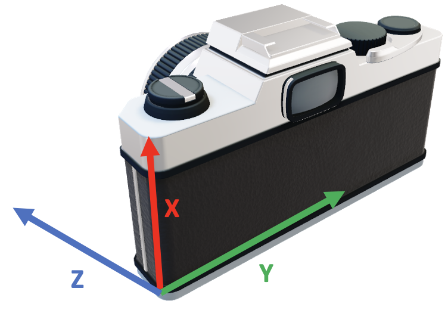
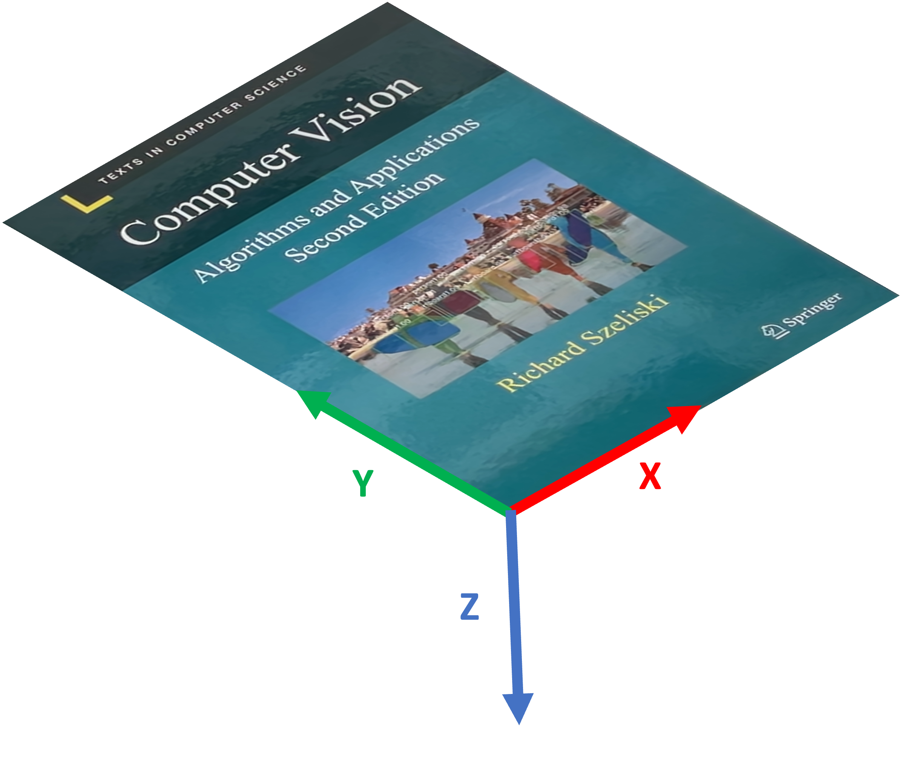
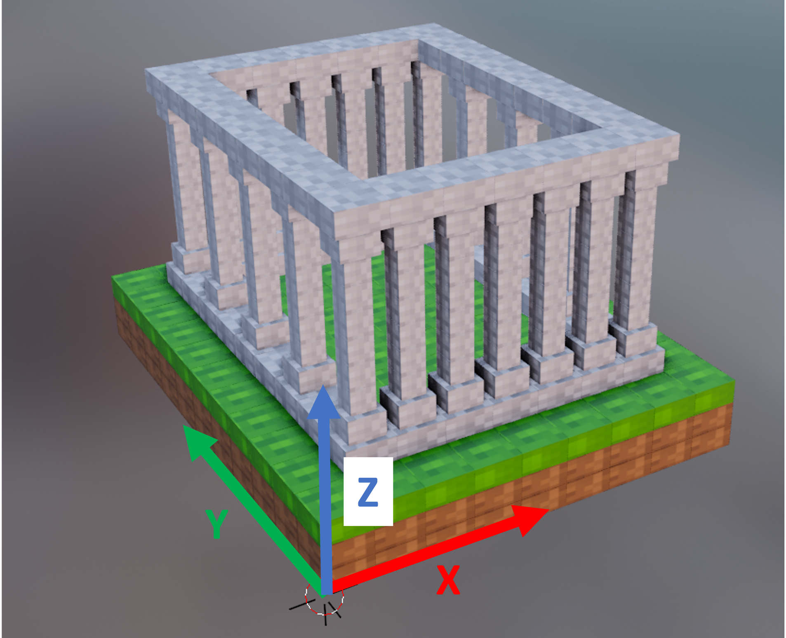

# Augmented Reality with 3D Rendering using Metal Shaders and OpenCV
This project showcases Augmented Reality by projecting a 3D Mesh Model onto a 2D reference surface. It is programmed solely in C++ and uses the metal-cpp library as Apple Silicon GPU interface. Also, OpenCV is being used for the usage of Computer Vision algorithms. As the IDE of choice, Visual Studio Code (VSCode) has been used.

This project works only on OSX devices with Apple Silicon GPUs. Also have a look at my other projects on [Augmented Reality with Python](https://github.com/Wissiak/augmented-reality-on-webcam) and [Augmented Reality on Android](https://github.com/Wissiak/augmented-reality-on-android).

## Showcase


## How does it work?
In this section I'm going to elaborate some of the key features of this project.

### Computer Vision Algorithms
In order to detect a reference image in the scene, Computer Vision algorithms for feature detection and feature matching are used. I'm using a SIFT detector for reliable matches and a Brute Force matcher with cross-check.
After computing the matches, they can be used to obtain a homography estimation. Note that it only works for planar objects as reference images. From this homography we can then extract the rotation matrix as well as the translation vector which then are used to render the 3D object in the right position.

### Coordinate Systems
Basically we have three different coordinate systems which we need to take care of: 
1. **Camera** (_width corresponds to number of columns (Y), height corresponds to number of rows(X)_)

2. **Reference Object** (_width corresponds to X, height corresponds to Y_)

3. **3D Mesh Model**


The 3D Mesh Model will be projected onto the reference object. In order to render the 3D Mesh Model correctly, I had to export it with the up axis being the negative Z-Axis so that it aligns with the reference object's coordinate frame.

### Rendering
As mentioned before, the Metal Shading Language is used to control Apple Silicon GPUs. The vertices of the 3D Mesh Model are then passed to the GPU which computes the position as well as the textures. 

In order to compile updates to the `model.metal`, the shell script `compile-metal-lib.sh` in the project root can be used. All it does is to built the metal library which then can be loaded from the C++ context.

## Knowledge Acquisition
The homography estimations work without prior camera calibration as provided in the course "Image Processing an Computer Vision 2" at the University of Applied Sciences in Eastern Switzerland (OST). 
The 3D Rendering utilizes the GPU for performance and is based on the great tutorial at https://metaltutorial.com. 

## Setup
First you need to [install OpenCV](https://docs.opencv.org/4.x/d0/db2/tutorial_macos_install.html) which you can do with homebrew. Afterwards, you have to adapt the path to OpenCV, `OpenCV_DIR`, in `src/CMakeLists.txt`.

To run the project, I use VSCode with the "CMake Tools" extension. If you get the following error: 
```
Assertion failed: (metalDefaultLibrary != nullptr), function createDefaultLibrary, file MetalEngine.cpp, line 39.
```
Make sure you run the project from the project root - this can be checked if the application prints the following in the beginning:
```
Current path is "<project-root>"
```

### New Reference Object
To register a new reference object, please refer to [Register new reference object](https://github.com/Wissiak/augmented-reality-on-webcam/tree/main#register-new-reference-object) on how to unwarp the image. Then copy the resulting image to assets/private and set the filename of the attribute `referenceImage` in `ARWebcam.hpp`.